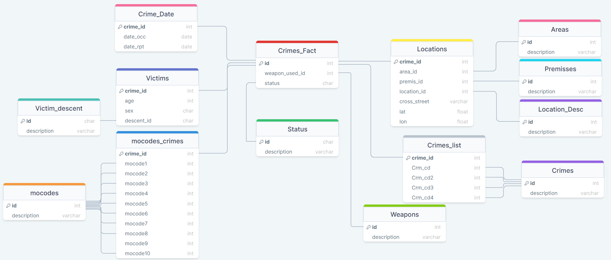

# Pipeline de Dados Usando Processamento Distribuído com Spark e Visualização de Dados com Google BigQuery

## Descrição do Projeto

Neste projeto foi desenvolvida uma pipeline ETL onde os dados vão ser extraídos de uma instância de banco de dados Microsoft SQL Server, após a extração é usado PySpark para a limpeza e transformação de dados e, por fim, a carga e a criação da estrutura no BigQuery é feita com Terraform onde os arquivos resultantes do processamento no cluster Spark são carregados a um Bucket na GCP e então carregados para dentro do BigQuery através de jobs que também foram criados pelo Terraform.

## Objetivos do Projeto
O principal objetivo deste projeto é demonstrar minha capacidade de criar Pipelines de Dados de uma ponta a outra, bem como demonstrar minhas habilidades com diversas ferramentas que são de extrema importância para um engenheiro de dados como SGBDs, Apache Spark, PySPark,outilização de serviços de nuvem e Google BigQuery.

Além disso, outro objetivo importante deste projeto é responder as seguintes perguntas com análise de dados:

- Qual a porcentagem de crimes que usaram armas de fogo ou brancas?
- Qual é a divisão de vítimas por faixa etária?
- Qual a arma mais comum de ser usada em crimes?
- Qual foi a área com a maior quantidade de crimes de 2020 até março de 2024?
- Qual é o perfil de vítma que é mais afetado pelos crimes?
- Qual foi o mês com a maior quantidade de crimes reportados?
- Quais foram os meses com a maior quantidade de crimes de cada ano? E os menores?
- Qual o tipo de crime mais comum? E o menos comum?
- Qual é a média móvel de crimes no mês de novembro de 2021?

## Tecnologias

As tecnologias utilizadas neste projeto foram:

 - [Docker](https://www.docker.com/)
 - [Python](https://www.python.org/)
 - [PySpark](https://spark.apache.org/docs/latest/api/python/index.html)
 - [Apache Spark](https://spark.apache.org/)
 - [Microsoft SQL Server](https://www.microsoft.com/pt-br/sql-server/sql-server-downloads)
 - [Terraform](https://www.terraform.io/)

## Dataset
O dataset usado neste projeto foi o [Crime Data from 2020 to Present] disponível no Kaggle e pode ser acessado nesse [link](https://www.kaggle.com/datasets/sahirmaharajj/crime-data-from-2020-to-present-updated-monthly/data). Abaixo temos um diagrama do dataset original:

imagem-do-dataset-original.png

Ao todo o dataset possui 28 colunas, elas são:

- **DR_NO**: identificador único dos registros;
- **Date_Rptd**: data que o crime foi reportado;
- **Date_OCC**: data que o crime aconteceu;
- **Time_OCC**: horário que o crime aconteceu;
- **Area**: id da área do crime; 
- **Area_Name**: nome da área do crime;
- **Rpt_Dist_No**: da pra deletar;
- **Part_1-2**: da pra deletar;
- **Crmd_Cd**: código do crime;
- **Crmd_Desc**: descrição do crime;
- **Mocodes**: atvidades associadas a quem cometeu o crime;
- **Vict_Age**: idade da vítima;
- **Vict_Sex**: sexo da vítima;
- **Vict_Descent**: descendência da vítima;
- **Premis_Cd**: código do tipo de estrutura, veículo ou localização do crime;
- **Premis_Desc**: descrição do código descrito no item anterior;
- **Weapon_Used_Cd**: código da arma usada no crime;
- **Weapon_Desc**: descrição do código descrito no item anterior;
- **Status**: código do status do crime;
- **Status_Desc**: descrição do código descrito no item anterior;
- **Crmd_Cd_1**: código do crime, mesmo que Crmd_Cd
- **Crmd_Cd_2, Crmd_Cd_3 e Crmd_Cd_4**: códigos de crimes menores;
- **Location**: endereço da rua do crime;
- **Cross Street**: rua transversal, se existir;
- **Lat e Lon**: latitude e longitude do lugar;

Também fazemos uso da descrição dos códigos descritos no campo "Mocodes" que podem ser obtidos no site https://data.lacity.org/. Os códigos serão disponibilizados com o nome MO_CODES-MO_CODES_Numerical_20191119.csv na pasta "scripts-database" do projeto para facilitar o uso, porém, o csv do dataset deverá ser baixado diretamente do Kaggle por causa do seu tamanho.

## Extração de Dados
A extração de dados é feita através de uma conexão JDBC com o banco de dados. O intuito de fazer a extração diretamente do banco de dados ao invés de um arquivo CSV comum é o de simular um banco de dados transacional como temos em situações reais.

## Limpeza e Transformação de Dados
Vários processos de limpeza e transformação de dados foram aplicados na pipeline de dados, abaixo vou explicar em detalhes como cada um dos campos do dataset original foi tratado. Abaixo também temos um diagrama demonstrando como ficou o dataset após o processo.



### Campos de Data
Os campos de data Date_Rpt foi tratado transformando-o de um campo no formato de MM/DD/YYYY HH:MM:SS para o formato YYYY-MM-DD, o descarte dos dados relacionados ao horário que o crime foi reportado se deve ao fato de que como não existe nenhum outro campo que consiga nos fornecer esses dados no dataset.

Já os campos Date_OCC e Time_OCC foram unidos em um único campo chamado DateTime_OCC onde removemos os valores errados de tempo que existia anteriormente e combinamos com o valores de Time_OCC, formando assim uma única coluna com valores Datetime corretos.

### Campos de Área
Nos campos relacionados à área que o crime ocorreu temos as colunas Area e Area_Name do dataset original, em especial a coluna Area_Name possui diversos valores duplicados pelo dataframe inteiro, por isso, esses dados foram transferidos para um novo dataframe onde cada valor da coluna será registrado apenas uma vez e seu acesso será feito através de relacionamentos usando o campo Area que tem o papel de um identificador único, diminuindo assim a quantidade de dados duplicados no dataset.

### Campos de Descrições de Crimes
Com os campos de crimes a abordagem adotada foi a mesma dos campos de área, foi criado um novo dataframe com valores distintos de descrição de crimes, diminuindo assim, a quantidade de dados duplicados. A coluna Crmd_Cd funciona como um identificador único para cada descrição de crime.

Além disso, foi criado também outro dataframe que vai armazenar os códigos de todos os crimes cometidos, sejam eles o mais grave (Crmd_Cd) ou os mais leves (Crmd_Cd_2-4) para que sejam relacionandos com as suas respectivas descrições em uma futura análise. A coluna Crmd_Cd_1 foi descartada por ser apenas uma réplica dos valores na coluna Crmd_Cd. 

### Campos de Vítimas
Existem três colunas que armazenam dados das vítimas, elas são: Vict_Age, Vict_Sex, Vict_Descent. Primeiro os valores nulos de Vict_Sex e Vict_Descent foram preenchidos com o valor 'X' que demonstra que o valor original do dado é desconhecido. Também foram substituidos valores que não correspondiam a nenhum valor conhecido por 'X' como por exemplo o valor '-' em ambas colunas.

Também foi criado um dataframe para armazenar a descrição de cada uma das descendências, utilizando o valor presente no dataset de vítimas como identificador e as descrições forecidas na página do dataset no Kaggle, tornando possível uma análise mais detalhada no futuro utilizando esse relacionamento.

### Campos de Modus Operandi
O campo Mocodes do dataset original é um string que possui até 10 códigos de modus operandi do suspeito, cada um deles separado por um espaço em branco. A transformação aplicada nesse campo foi dividi-lo em 10 colunas, uma para cada código. Esses códigos podem ser relacionados com suas respectivas descrições que estão em outro dataframe que pode ser visto no diagrama apresentado anteriormente.

### Campos de Premisses
Nos campos de premisses preenchemos os valores nulos na coluna Premis_Cd por 0 e Premis_Desc por 'Unknown'. Além disso, também existem dados em que existe um código associado porém não existe uma descrição, nesses casos foi alterado o valor de Premis_Cd para 0 também.

Depois de ser feito a limpeza os dados são levados para um novo dataframe mas considerando apenas valores distintos, evitando assim, duplicidade de dados no resultado final.

### Campos de Armas
Nos campos de armas são selecionadas todas as armas distintas e levadas a um dataframe separado onde vão ser armazenadas a sua descrição. Com isso é possível criar um relacionamento entre o dataframe de crimes e o dataframe de armas através do valor do código de cada arma além de evitar a duplicidade de dados.

### Campos de Status
Ao todo no dataframe existem seis status possíveis, por isso os valores distintos são levados para um dataframe separado onde vai existir um relacionamento através do id, evitando assim, a duplicidade de dados.

### Campos de localização
Como existem diversas colunas com dados relacionados ao local do crime os dados foram divididos em dois dataframes. Um deles vai conter um id associado a localização e sua descrição, o id foi gerado utilizando a função monotonically_increasing_id() do pyspark pois não existia nada do tipo no dataset original. A intenção por trás disso é de reduzir a duplicidade de dados pois existe uma quantidade muito menor de localizações únicas do que a quantidade de crimes.

O outro dataframe que foi criado é o que vai armazenar as outras colunas relacionadas como: id da área, id da localização, Cross_Street, Premis_Cd, latitude e longitude. Dessas colunas é feito uma limpeza nos valores nulos de latitude e longitude, os valores nulos são substituidos pela média dos valores de outros crimes que ocorreram na mesma localização cujo valor não é zero. Em alguns casos não existe informação o suficiente para tentar aproximar os valores, nesses casos foi decidido que o valor continuaria a ser 0.

## Campos Desnecessários
Existem alguns campos que não apresentam nenhuma informação relevante para análise, os campos são: Rpt_Dist_No e Part_1_2. Esses campos foram descartados.

## Carga de Dados
Após os dados serem processados pelo cluster spark eles são carregados para um bucket no GCP com o nome de 'bucket-dw-modeling-pedro', caso você tente reproduzir o projeto será necessário mudar o nome no arquivo main.tf da pasta IAC para um bucket criado na sua conta.

O upload é feito através do recurso do terraform chamado google_storage_bucket_object, após isso o dataset e as tabelas do BigQuery são criadas usando os recursos google_bigquery_dataset e google_bigquery_table, e por fim, os dados são carregados para dentro do BigQuery através de jobs que são criados com o recurso google_bigquery_job.

## Como Usar

Para executar este projeto um dos pré-requisitos será ter Docker instalado no seu computador, você pode encontrar um tutorial de como instalar o Docker para o seu sistema operacional [aqui](https://docs.docker.com/engine/install/). Também é necessário ter uma conta ativa na GCP para que seja possível usar os recursos do BigQuery e Storage Bucket.

Com o Docker instalado e uma conta na GCP abra a linha de comando do seu sistema operacional e execute os seguintes passos:

- Clone o repositório para o seu diretório local
```bash
git clone https://github.com/pedrohcg/Data-Pipeline-For-La-Crimes-Dataset.git
```

- Com o código fonte baixado vamos criar o cluster spark, para isso entre no diretório do projeto pela linha de comando e entre na pasta cluster-spark:
```bash
cd cluster-spark
```

- Então executamos o comando para criar o cluster. A quantidade de workers pode ser alterada na flag "scale", para esse projeto vou criar um cluster com 5 workers.
```bash
docker-compose -f docker-compose.yml up -d --scale spark-worker-yarn=5
```

- Com o cluster pronto temos que configurar o CLI do GCP no master do cluster, para isso temos que nos conectar ao master com o comando abaixo, porém também podemos nos conectar ao container diretamente pelo Docker Desktop:
```bash
docker exec -it spark-master-yarn /bin/bash
```

- Conectado no container vamos executar o comando abaixo e seguimos com os procedimentos de autenticação do Google. Obs: caso você tenha optado por se conectar ao master via linha de comando não se esqueça de sair do container antes de executar os próximos
```bash
gcloud auth application-default login
```

- Com o cluster pronto precisamos preparar o banco de dados, para isso vamos entrar na pasta scripts-database
```bash
cd ../scripts-database
```

- Então temos que criar uma imagem para o container que vai rodar o banco de dados com o seguinte comando:
```bash
docker build -t mssql-database-data-pipeline .
```

- Depois vamos criar o container usando a imagem que acabamos de criar, também passamos a flag "network" para colocar a container na mesma network que o cluster spark para que assim seja possível a comunicação entre ambos. O banco de dados que vai ser criado com essa imagem já terá os dados do dataset importados caso eles tenham sido baixados e colocados na pasta scripts-database com antecedência.
```bash
docker run -p 1433:1433 --name mssql2 --network cluster-yarn_default -d mssql-database-data-pipeline
```

- Agora que já temos quase tudo pronto para executar a pipeline vamos verificar qual foi o ip que o docker atribuiu ao conteiner do banco
```bash
docker network inspect cluster-yarn_default
```

- E então copiamos o valor do campo "IPv4Address" do container "mssql" e o substituimos no valor da variável "database_ip" no arquivo extract-transform.py que fica na pasta cluster-spark/jobs/

- Com esses passos feitos só nos resta executar a pipeline, para isso executamos o seguinte comando:
```bash
docker exec spark-master-yarn ./pipeline.sh
```

- Pronto! Agora você tem um DW na nuvem pronto para ser usado para análises.

## Resultados